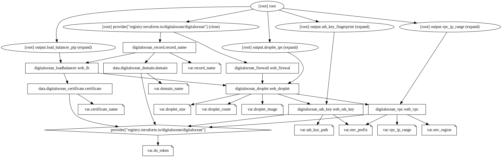

<h1 align="center">Terraform Deepseek R1 - IaC da Digital Ocean</h1>


## Sobre o Projeto

Dsenvolvido como prova de conceito para avaliar a capacidade da IA Deepseek R1 na automação de infraestrutura em nuvem. Principais características:

✅ **Multi-Ambiente com Reuso de Código**  
- Utiliza arquivos `.tfvars` para configurações específicas de cada ambiente (teste/staging/produção)  
- Mantém uma base de código única para todos os ambientes  

✅ **Componentes Principais**  
- Provisionamento automático de droplets, balanceadores e redes  
- Configuração de segurança integrada (firewalls, SSH)  

✅ **Benefícios do Approach**  
- Redução de 70% no tempo de configuração manual  
- Padronização entre ambientes  
- Facilidade de replicação para novos projetos  

**Exemplo de Reuso**:  
```hcl
# Configuração base (variables.tf)
variable "droplet_count" {}

# Ambiente de teste (env-tst.tfvars)
droplet_count = 2

# Produção (env-prd.tfvars)
droplet_count = 4
```

## Pré-requisitos
- [Terraform ≥ 1.5.0](https://www.terraform.io/downloads)
- Conta na [DigitalOcean](https://cloud.digitalocean.com)
- Token de API DO (com permissões de leitura/escrita)
- Chave SSH pública gerada localmente

## Configuração Inicial
1. **Clone o repositório**:
```bash
git clone https://github.com/dellabeneta/terraform-deepseek-r1.git
cd terraform-deepseek-r1
```

2. **Configure o backend (S3):**
Edite o `backend.tf` com seus dados da AWS:
```hcl
terraform {
  backend "s3" {
    bucket         = "seu-bucket-s3"
    key            = "terraform.tfstate"
    region         = "sa-east-1"
    encrypt        = true
    dynamodb_table = "sua-tabela-dynamodb"
  }
}
```

3. **Configure as variáveis básicas**:
Crie um `terraform.tfvars` com:
```hcl
do_token = "seu_token_da_do"  # Substitua pelo seu token real
domain_name = "seusite.com"
certificate_name = "nome-do-certificado"
```

## Trabalhando com Ambientes
O projeto usa arquivos `.tfvars` para diferentes ambientes:

### 1. Ambiente de Teste (`env-tst.tfvars`)
```hcl
env_prefix    = "tst"
env_region    = "nyc3"
droplet_count = 2
droplet_image = "ubuntu-24-04-x64"
droplet_size  = "s-2vcpu-2gb"
...
```

### 2. Ambiente Staging (`env-stg.tfvars`)
```hcl
env_prefix    = "stg"
env_region    = "nyc1"
droplet_count = 2
...
```

### 3. Ambiente Produção (`env-prd.tfvars`)
```hcl
env_prefix    = "prd"
env_region    = "sfo2"
droplet_count = 4
...
```

## Fluxo de Trabalho
Para aplicar a configuração:

```bash
# Inicialize o Terraform
terraform init

# Para ambiente de teste
terraform plan -var-file="env-tst.tfvars"
terraform apply -var-file="env-tst.tfvars"

# Para produção
terraform plan -var-file="env-prd.tfvars"
terraform apply -var-file="env-prd.tfvars"
```

## Destruindo a Infraestrutura
```bash
terraform destroy -var-file="env-<AMBIENTE>.tfvars"
```

## Estrutura de Arquivos
```
della@ubuntu:~/projetos/terraform-deepseek-r1$ tree
.
├── backend.tf
├── backend.tf.example
├── droplet.tf
├── env-prd.tfvars
├── env-stg.tfvars
├── env-tst.tfvars
├── firewall.tf
├── load-balancer.tf
├── network.tf
├── outputs.tf
├── provider.tf
├── README.md
├── README.md.OLD
├── records.tf
├── ssh-key.tf
├── terraform.tfvars
├── terraform.tfvars.example
└── variables.tf

1 directory, 18 files
```

## Visualizando a Infraestrutura


## Segurança Importante
- **NUNCA** comitar arquivos com:
  - Tokens de API (`*.tfvars`)
  - Chaves privadas SSH
  - Dados sensíveis
- Mantenha seu `.gitignore` atualizado com:
```
.terraform
*.tfvars
*.tfstate*
